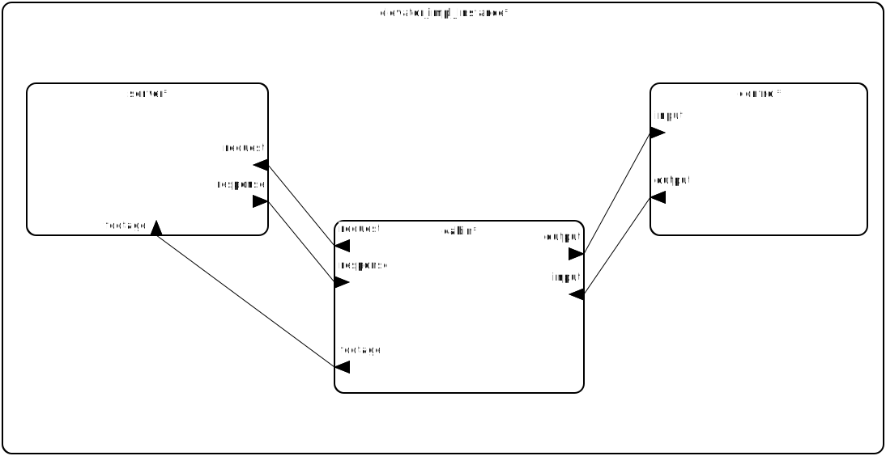
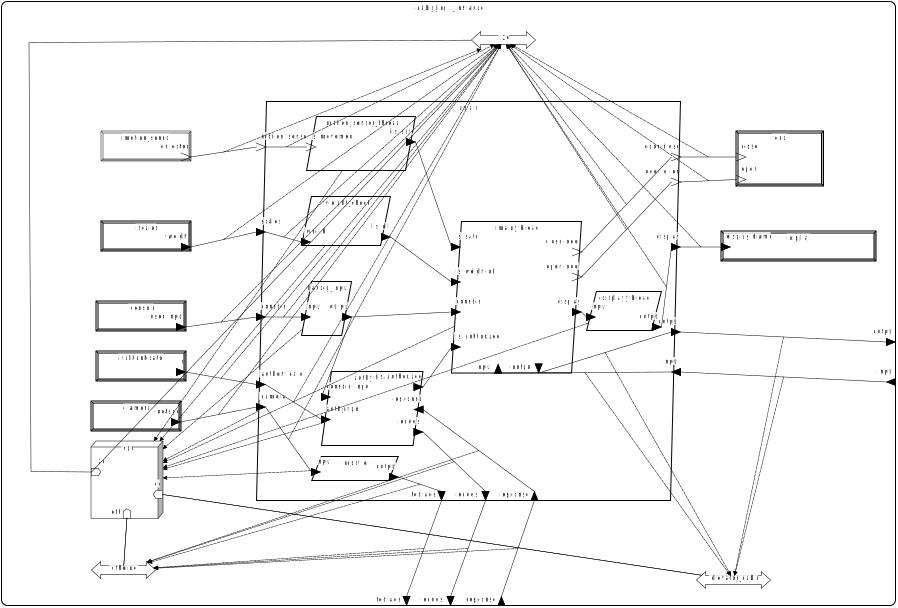
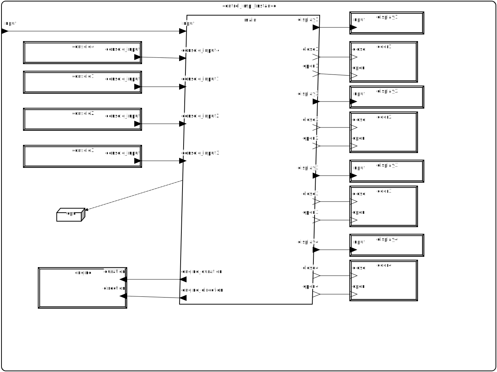
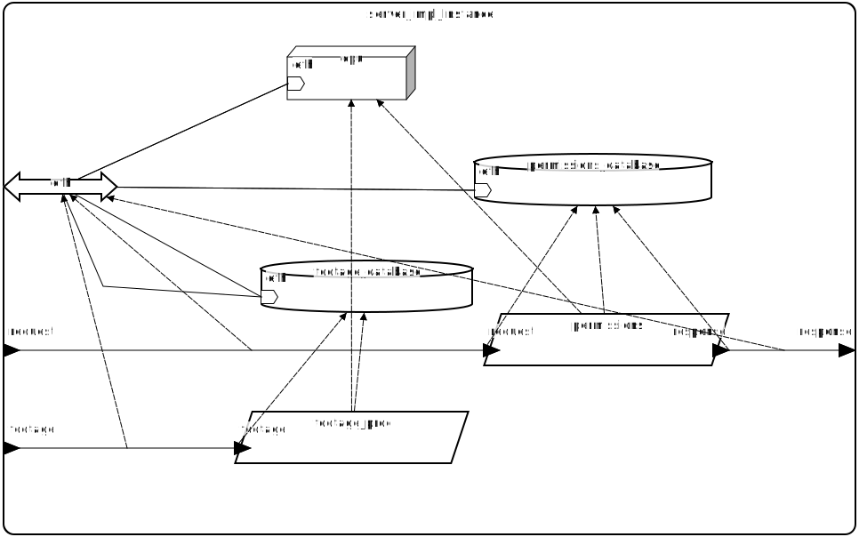

# Systemy czasu rzeczywistego - model windy w AADL
Paweł Froń - pawelfron@student.agh.edu.pl

## Opis projektu
Projektowany system modeluje zachowanie windy w budynku.

## Wymagania funkcjonalne
- dwa przyciski na każdym piętrze (w górę, w dół)
- jedna kabina
- uruchamianie alarmu z wewnątrz kabiny
- waga w kabinie; jeśli obciążenie przekracza ustalony limit, winda nie ruszy się z miejsca
- system zezwoleń do jechania na konkretne piętra, sprawdzany przez kartę

## Komponenty
System składa się z trzech podsystemów:
- kabiny - opisuje wszystko wewnątrz kabiny,
- zewnętrzny - opisuje szyb, drzwi zewnętrzne, przyciski zewnętrzne,
- serwera - opisuje serwer zarządzający uprawnieniami.

#### Podsystem kabiny
Urządzenia:
- drzwi,
- ekran,
- konsola,
- urządzenie czytujące karty,
- waga,
- czujnik ruchu,
- kamera

Wątki:
- autentykacyjny,
- sprawdzający wagę,
- sprawdzający czujnik ruchu,
- zarządający ekranem,
- pobierający wejście z konsoli,
- główny, otwierający i zamykający drzwi i wysyłający informację na zewnątrz,
- zarządzający kamerą.

#### Podsystem zewnętrzny
Urządzenia:
- silnik,
- konsola na każdym piętrze,
- wyświetlacz na każdym piętrze,
- drzwi na każdym piętrze.

#### Podsystem serwera
Procesy:
- zarządzający uprawnieniami,
- zarządzający materiałem z kamery z kabiny.

