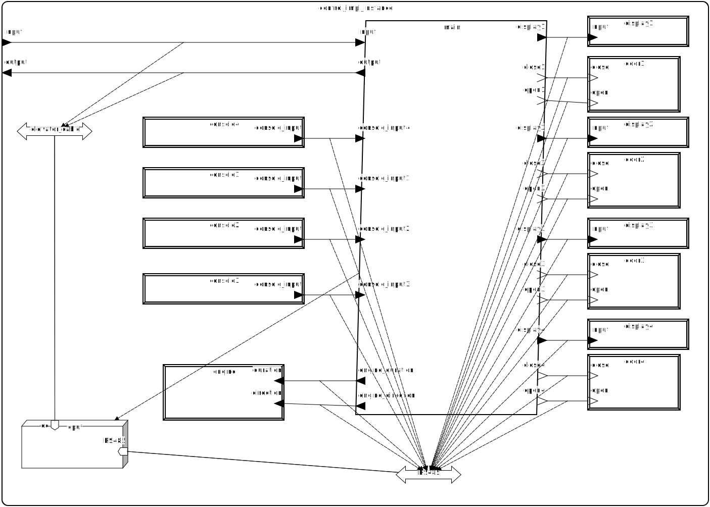

# Systemy czasu rzeczywistego - model windy w AADL
Paweł Froń - pawelfron@student.agh.edu.pl

## Opis projektu
Projektowany system modeluje zachowanie windy w budynku.

### Wymagania funkcjonalne
- dwa przyciski na każdym piętrze (w górę, w dół)
- jedna kabina
- waga w kabinie; jeśli obciążenie przekracza ustalony limit, winda nie ruszy się z miejsca
- system zezwoleń do jechania na konkretne piętra, sprawdzany przez kartę

### Opis dla użytkownika
Użytkownik chcący pojechać na dane piętro, naciska odpowiedni przycisk i przykłada swoją kartę do czytnika w kabinie. Następnie, jeśli serwer zarządzający uprawnieniami na to zezwoli, oraz nie będzie innych przeszkód do rozpoczęcia podróży (przeciążenie, ruch przy drzwiach kabiny).

## Komponenty
System składa się z trzech podsystemów:
- kabiny - opisuje wszystko wewnątrz kabiny,
- zewnętrzny - opisuje szyb, drzwi zewnętrzne, przyciski zewnętrzne,
- serwera - opisuje serwer zarządzający uprawnieniami.

#### Podsystem kabiny
1. Urządzenia:
- drzwi,
- ekran,
- konsola,
- urządzenie czytujące karty,
- waga,
- czujnik ruchu,
- kamera

2. Wątki:
- główny, otwierający i zamykający drzwi i wysyłający informację na zewnątrz,
- autentykacyjny,
- sprawdzający wagę,
- sprawdzający czujnik ruchu,
- zarządający ekranem,
- pobierający wejście z konsoli,
- zarządzający kamerą.

3. Proces zawierający powyższe wątki.

4. Procesor wykonujący powyższy proces.

5. Magistrale:
- Ethernet - używany do komunikacji z serwerem,
- I2C - używany do komunikacji z urządzeniami wewnątrz kabiny,
- Kabel do wind - używany do komunikacji z podsystemem wewnętrznym.

#### Podsystem zewnętrzny
1. Urządzenia:
- silnik,
- konsola na każdym piętrze,
- wyświetlacz na każdym piętrze,
- drzwi na każdym piętrze.

2. Proces zarządzający powyższymi urządeniami.

3. Procesor wykonujący powyższy proces.

4. Magistrale:
- RS485 - używany do komunikacji z silnikiem i urządzeniami na każdym piętrze,
- Kabel do wind - używany do komunikacji z kabiną.

#### Podsystem serwera
1. Procesy:
- zarządzający uprawnieniami,
- zarządzający materiałem z kamery z kabiny.

2. Procesory wykonujący powyższe procesy.

3. Pamięci:
- baza danych zezwoleń,
- baza danych materiału z kamery.

4. Magistrale:
- Ethernet - używany do komnikacji z kabiną.

## Literatura
1. Standard RS-485 https://en.wikipedia.org/wiki/RS-485
2. Elevator Travelling Cable - Design Evolution, Richard Laney https://www.prysmian.com/sites/default/files/atoms/files/CABLEDES1.pdf
3.  A guide to elevator access control: How to integrate with card or mobile access https://www.getkisi.com/guides/elevators